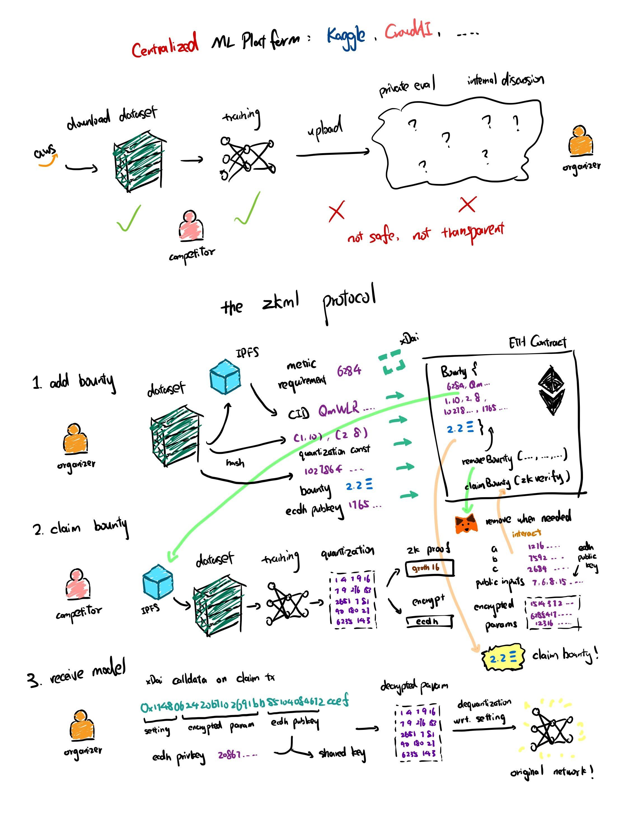

## zkml core

_Truly private machine learning._

This is a demo of the zkml protocol, which implements a zk-SNARK circuit where the proof verifies that a private model has a certain accuracy under a public dataset, as well as the public encrypted model is exactly the private model encrypted using the shared key. 

Presentation: https://www.loom.com/share/fdbe451385dd4a22b5593bf80747a4be

### Running

* download `powersOfTau28_hez_final_18.ptau` from circom and move to `circuits`
* `mkdir artifacts && mkdir artifacts/lr` to store artifacts
* `cd circuits && yarn prod` to build the circuits
* `cd eth && yarn compile && yarn deploy-{NETWORK}` to deploy the contracts
* set up Infura IPFS with `keys/ipfs.json` containing `{"id": ..., "secret": ...}`
* `export PRIVATE_KEY=... && export URL=...` to export private key and RPC URL
* for the jupyter demo, run `jupyter kernelspec list` to find `kernel.json` and add an `"env": {"PRIVATE_KEY": ..., "URL": ...}` entry
* `./zkml` to interact with cli (xDai)

### Check it out on-chain

**There is an outstanding 20 xDai bounty on the contract, available for claim as of December 2021.**

https://blockscout.com/xdai/mainnet/address/0x5B54f06991871cd7EAE76a3D270D9EFFBdC01207/contracts

### Protocol Overview

### Special Thanks

* ETH Summer
* Lattice
